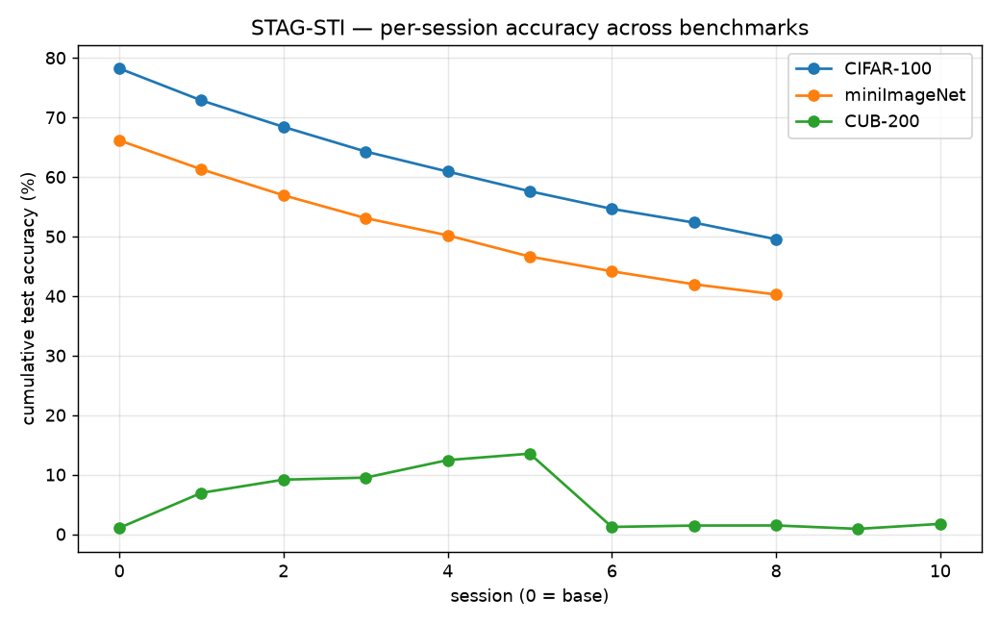

# STAG-STI — Results & Analysis

_Generated 2026-09-08 18:52 • auto-updated as runs complete._

## In-domain results

| Dataset | A₀ (base) | A_T (final) | PD ↓ | Avg | A_B | A_N | HM |
|---|---|---|---|---|---|---|---|
| CIFAR-100 | 78.22 | 49.53 | 28.69 | 62.08 | 68.72 | 20.75 | 31.87 |
| miniImageNet | 66.13 | 40.25 | 25.88 | 51.18 | 56.12 | 16.45 | 25.44 |
| CUB-200 | 77.79 | 49.71 | 28.09 | 60.88 | 68.99 | 30.85 | 42.64 |

## Cross-domain (miniImageNet → CUB)

- _pending_

## Comparison vs. published methods (final-session accuracy %)

| Method | CIFAR-100 | miniImageNet | CUB-200 |
|---|---|---|---|
| FACT | TODO | TODO | 56.94 |
| SAVC | TODO | TODO | 62.50 |
| CLOSER | TODO | TODO | 63.58 |
| **STAG-STI (ours)** | **49.53** | **40.25** | **49.71** |

_CUB-200 baselines from the Review-1 deck; CIFAR-100 / miniImageNet baselines are TODO — fill from the source papers._

## Ablation study (CIFAR-100)

| Configuration | A₀ | A_T | PD ↓ | Avg |
|---|---|---|---|---|
| Full model | 78.22 | 49.53 | 28.69 | 62.08 |
| − supcon | 78.53 | 49.28 | 29.25 | 62.00 |
| − topology | 77.75 | 49.69 | 28.06 | 61.65 |
| − agedecay | 78.60 | 49.51 | 29.09 | 62.14 |

## Per-session curves

